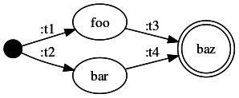
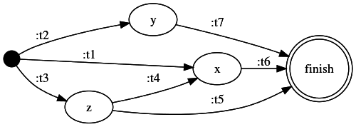

# fsmviz

Generate [Graphviz]() diagrams from FSM data using Clojure or Clojurescript.

## Release

### Leiningen

```clojure
[fsmviz "0.1.4"]
```

## Usage

Diagrams can be generated using FSM data in the form of either `[from via to]`
triples, or maps of state -> transition map.


```clojure
(require '[fsmviz.core :as fsmviz])
```

```clojure
(fsmviz.core/generate-image {:start {:t1 :foo
                                     :t2 :bar}
                             :foo {:t3 :baz}
                             :bar {:t4 :baz}} "example-map")

```



```clojure
(fsmviz.core/generate-image [[:start :t1 :x]
                             [:start :t2 :y]
                             [:start :t3 :z]
                             [:z :t4 :x]
                             [:z :t5 :finish]
                             [:x :t6 :finish]
                             [:y :t7 :finish]] "example-tuples"))
```



## Clojurescript Demo

A simple demo with Clojurescript, created using Figwheel, can be found at
examples/demo-cljs. To run the demo:

`$> cd examples/demo-cljs`

`$> lein fighweel`

After the Figwheel webserver starts, visit `http://localhost:3449` to view the
demo.

## Javascript Demo & API

You can also use this library from Javascript. You must use the tuple form for
state machine data, and string names, rather than keywords.

```javascript
fsmviz.core.generate_image_js(
        [[null,     "birth",       "human"],
         ["human",  "bitten",      "zombie"],
         ["zombie", "brain death", "corpse"]],
        "a graph name");
```

See [example.html](resources/example.html) for a complete example.

## TODO

The Javascript binary is 2.6 MB, currently.  Largely due to the depenency on
viz.js, which is 2.1 MB.  Can this be improved?

## License

The MIT License (MIT)

Copyright (c) 2016 Jeb Beich

Permission is hereby granted, free of charge, to any person obtaining a copy of
this software and associated documentation files (the "Software"), to deal in
the Software without restriction, including without limitation the rights to
use, copy, modify, merge, publish, distribute, sublicense, and/or sell copies
of the Software, and to permit persons to whom the Software is furnished to do
so, subject to the following conditions:

The above copyright notice and this permission notice shall be included in all
copies or substantial portions of the Software.

THE SOFTWARE IS PROVIDED "AS IS", WITHOUT WARRANTY OF ANY KIND, EXPRESS OR
IMPLIED, INCLUDING BUT NOT LIMITED TO THE WARRANTIES OF MERCHANTABILITY,
FITNESS FOR A PARTICULAR PURPOSE AND NONINFRINGEMENT. IN NO EVENT SHALL THE
AUTHORS OR COPYRIGHT HOLDERS BE LIABLE FOR ANY CLAIM, DAMAGES OR OTHER
LIABILITY, WHETHER IN AN ACTION OF CONTRACT, TORT OR OTHERWISE, ARISING FROM,
OUT OF OR IN CONNECTION WITH THE SOFTWARE OR THE USE OR OTHER DEALINGS IN THE
SOFTWARE.
